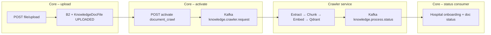

# Knowledge upload & crawler flow

This document describes how hospital knowledge documents are uploaded in **core-service**, how **bot activation** publishes Kafka events, and how **crawler-service** processes them and reports status back.

> **Important:** The file upload route does **not** publish to Kafka. Upload only stores files in object storage and MongoDB. Kafka is used when the owner calls **activate bot** with `document_crawl` (or `website_crawl`).

---

## End-to-end overview



### Kafka topics (shared contract)

| Topic | Constant | Producer | Consumer |
|-------|----------|----------|----------|
| `knowledge.crawler.request` | `KNOWLEDGE_CRAWLER` | core-service (`activateBot`) | crawler-service |
| `knowledge.process.status` | `KNOWLEDGE_PROCESS_STATUS` | crawler-service | core-service (`hospital.status-consumer`) |

Defined in `shared/events/knowledge-crawler.events.js`.

---

## Part 1: File upload route

### Route definition

**File:** `core-service/src/modules/hospital/hospital.routes.js`

```http
POST /api/hospital/:hospitalId/file/upload
```

**Middleware chain:**

1. `verifyToken` — JWT + Redis `jti` blacklist → `req.user`
2. `checkHospitalOwnerShip` — owner must match hospital → `req.hospital`
3. `uploadKnowledgeDocs` — alias for `streamingUploadHandler` in `upload.handler.js`

**Controller:** `hospital.controller.js` delegates directly to the streaming handler (no extra logic).

### Request format

- **Content-Type:** `multipart/form-data`
- **One file** per request
- **Optional field:** `hash` — client-side SHA-256 (dedup + integrity)

### Limits & allowed types

| Rule | Value |
|------|--------|
| Allowed extensions | `pdf`, `docx`, `txt` |
| Max file size | 10 MB |
| Max documents per hospital | 20 |
| Max total storage per hospital | 10 MB (aggregate) |

MIME type must match file extension. Magic-byte validation runs on the stream (PDF / ZIP for docx / UTF-8 for txt).

### Streaming pipeline

```
fileStream → magic bytes → size limit → SHA-256 → PassThrough → B2 (S3-compatible) upload
```

1. **Dedup:** If `hash` is sent and a doc exists for `(hospitalId, hash)` → **200** `already_uploaded` with existing `fileRef`.
2. **Object key (`fileRef`):** `{hospitalId}/{uuid}-{sanitizedFileName}`
3. **After upload:** Check total hospital size; compare client `hash` vs server hash if provided.
4. **MongoDB:** Create `KnowledgeDocFile` with `status: 'UPLOADED'`.
5. **Response 201:** `{ id, fileName, fileRef, mimeType, sizeBytes }`

**Storage:** Backblaze B2 via `core-service/src/modules/upload/storage.service.js`.

**Model:** `KnowledgeDocFile` — statuses: `UPLOADED` → `PROCESSING` → `ACTIVE` | `FAILED`.

Upload does **not** change hospital onboarding or touch Kafka.

---

## Part 2: Bot activation (Kafka publish)

### Route

```http
POST /api/hospital/:hospitalId/activate
Authorization: Bearer <accessToken>
Content-Type: application/json
```

### Document crawl body example

```json
{
  "type": "document_crawl",
  "documents": [
    { "fileRef": "<hospitalId>/<uuid>-report.pdf" }
  ]
}
```

### Website crawl body example

```json
{
  "type": "website_crawl",
  "websiteUrl": "https://example-hospital.com"
}
```

Validation: `hospital.validator.js` (`activateBotSchema`).

### Service flow (`hospital.service.js` → `activateBot`)

1. Reject if onboarding step is already `knowledge_processing` (**409**).
2. **`document_crawl`:** Resolve `fileRef`s in DB for this hospital; set docs to **`PROCESSING`**.
3. **`website_crawl`:** SSRF-safe URL check; no document records.
4. Set hospital `onboarding.step` → `knowledge_processing`, store `eventId`, type, `requestedAt`.
5. Invalidate Redis cache `hospital:{hospitalId}`.
6. Publish event to **`knowledge.crawler.request`**.

### Crawler event payload

```json
{
  "eventId": "<uuid>",
  "hospitalId": "<string>",
  "type": "document_crawl",
  "websiteUrl": null,
  "documents": [
    {
      "fileRef": "...",
      "fileName": "...",
      "mimeType": "application/pdf"
    }
  ],
  "requestedAt": "<ISO8601>"
}
```

For `website_crawl`, `documents` is `null` and `websiteUrl` is set.

**API response:** **202** — `status: IN_PROGRESS`.

---

## Part 3: Crawler service

**Entry:** `crawler-service/server.js` — warmup embeddings → `startConsumer()`.

**Consumer:** `crawler-service/src/consumer.js`

- **Group:** `CRAWLER_CONSUMER_GROUP` (default `crawler-service-group`)
- **Subscribe:** `knowledge.crawler.request`
- **Dispatch:**
  - `website_crawl` → `handleWebsiteCrawl`
  - `document_crawl` → `handleDocumentCrawl`
- **Always publish** result to `knowledge.process.status` (success or failure).

### Status event payload

```json
{
  "eventId": "<same as request>",
  "hospitalId": "<string>",
  "type": "document_crawl",
  "success": true,
  "error": null,
  "stats": {
    "pagesOrFiles": 2,
    "chunks": 45
  },
  "finishedAt": "<ISO8601>"
}
```

### Document crawl (`document-crawl.handler.js`)

| Phase | Description |
|-------|-------------|
| 1. Download | B2 `GetObject` using `fileRef` → temp file |
| 2. Extract | `extractText` (PDF / DOCX / TXT) |
| 3. Chunk | `chunkText` for RAG |
| 4. Embed | `generateEmbeddings` |
| 5. Qdrant | `upsertEmbeddedChunks(hospitalId, ingestionId, chunks)` — `ingestionId` = `eventId` |
| 6. Swap | Delete older vectors for hospital except current ingestion |
| 7. Cleanup | Remove temp files |

On Qdrant failure: compensation delete by `ingestionId`, then failure status event.

### Website crawl (`website-crawl.handler.js`)

Playwright BFS from `websiteUrl` (page/depth limits, SSRF guard) → same chunk → embed → Qdrant path.

---

## Part 4: Status consumer (core-service)

**File:** `core-service/src/modules/hospital/hospital.status-consumer.js`  
**Topic:** `knowledge.process.status`  
**Started from:** `core-service/server.js`

### On success

- Hospital: `onboarding.step` → `knowledge_ready`, `status` → `active` (only if `botActivation.eventId` matches).
- Documents in `PROCESSING` → **`ACTIVE`**.
- Delete cache `hospital:{hospitalId}`.

### On failure

- Hospital: `onboarding.step` → `crawler_failed`, store error on `botActivation`.
- Documents in `PROCESSING` → **`FAILED`** + `errorMessage`.

**Timeout:** `hospital.activation-timeout.js` marks stale `knowledge_processing` activations if no status arrives in time.

---

## Client integration checklist

1. **Login** → access token.
2. **Upload** each file → save each `fileRef` from **201** (or reuse **200** `already_uploaded`).
3. **Activate** with `document_crawl` and `fileRef` list → expect **202**.
4. **Poll** `GET /api/hospital/get-hospital/:hospitalId` until:
   - `onboarding.step === 'knowledge_ready'` (success), or
   - `onboarding.step === 'crawler_failed'` (failure).

---

## Key source files

| Area | Path |
|------|------|
| Upload route | `core-service/src/modules/hospital/hospital.routes.js` |
| Upload handler | `core-service/src/modules/upload/upload.handler.js` |
| Storage (B2) | `core-service/src/modules/upload/storage.service.js` |
| Doc model | `core-service/src/modules/upload/knowledgeDocFile.model.js` |
| Activate + Kafka publish | `core-service/src/modules/hospital/hospital.service.js` |
| Status consumer | `core-service/src/modules/hospital/hospital.status-consumer.js` |
| Crawler consumer | `crawler-service/src/consumer.js` |
| Document handler | `crawler-service/src/handlers/document-crawl.handler.js` |
| Website handler | `crawler-service/src/handlers/website-crawl.handler.js` |
| Event contract | `shared/events/knowledge-crawler.events.js` |
| Qdrant | `shared/qdrant/qdrant.client.js` |
